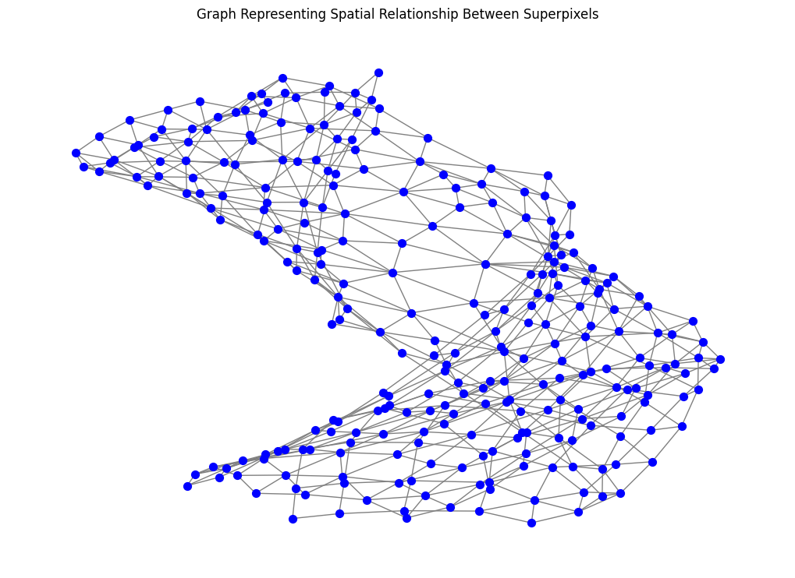

# Adaptive Hierarchical Image Segmentation using Deep Learning and Graph-based Visualization

## Overview
This project demonstrates a superpixel-based image segmentation pipeline using the SLIC (Simple Linear Iterative Clustering) algorithm. The segmentation process includes hierarchical merging for refinement and is evaluated using Adjusted Rand Index (ARI) and Boundary F1 Score. The pipeline also provides visualizations such as boundary overlays and a superpixel graph to analyze segmentation quality.

## Features
- **Superpixel Segmentation**
  - Uses the SLIC algorithm to generate superpixels.
  - Applies hierarchical merging to refine segmentation.
- **Quantitative Evaluation**
  - Adjusted Rand Index (ARI) measures similarity between segmentation and ground truth.
  - Boundary F1 Score evaluates the accuracy of segmentation boundaries.
- **Visualizations**
  - Boundary overlay to compare segmentation accuracy.
  - Superpixel Graph Representation (optional).
- **Reproducible & Modular**
  - Well-structured code, easy to extend for different datasets.

## Repository Structure
```
Adaptive-Hierarchical-Image-Segmentation/
├── src/                         # Main source code
│   ├── segmentation_pipeline.py  # Final Python script
├── notebooks/                    # Jupyter Notebook for step-by-step execution
│   ├── segmentation_demo.ipynb    # Interactive notebook
├── examples/                      # Input and output images
│   ├── segmentation.png           # Visualization of Original, Segmented Image and Boundary Overlay 
│   ├── superpixel_graph.png       # Graph visualization of superpixels
├── results/                       # Stores segmentation results and metrics
│   ├── metrics_summary.txt        # ARI and Boundary F1 scores for different images
├── docs/                          # Documentation and reports
│   ├── DIP_Project_Report.pdf     # Final coursework report
├── README.md                      # Project documentation
├── requirements.txt                # Dependencies
├── LICENSE                         # MIT License file
└── .gitignore                      # Prevents unnecessary files from being pushed
```

## Setup and Installation

### Clone the Repository
```bash
git clone [https://github.com/your-username/segmentation-project.git](https://github.com/ApoorvaN1701/Adaptive-Hierarchical-Image-Segmentation.git
cd Adaptive-Hierarchical-Image-Segmentation
```

### Install Dependencies
Ensure you have Python 3.8 or later installed. Install required dependencies using:
```bash
pip install -r requirements.txt
```

## How to Run

### Run the Python Pipeline
Execute the segmentation pipeline using:
```bash
python src/segmentation_pipeline.py
```
This script will:
- Preprocess the image
- Perform superpixel segmentation with hierarchical merging
- Evaluate segmentation using ARI and Boundary F1 Score
- Generate and display visualizations

### Run the Jupyter Notebook
For an interactive demonstration, open and execute the notebook:
```bash
jupyter notebook notebooks/segmentation_demo.ipynb
```

## Example Results

### Segmentation Outputs
 


### Metrics for Sample Image
- Adjusted Rand Index (ARI): `0.7934`
- Boundary F1 Score: `0.7942`

## Evaluation Metrics

### Adjusted Rand Index (ARI)
- Measures the similarity between segmentation and ground truth.
- A score closer to 1 indicates better segmentation.

### Boundary F1 Score
- Evaluates how well the segmentation captures boundaries.
- A higher score indicates more precise segmentation.

## Methodology

### Data Preprocessing
- **Resizing**: Image is resized to `224x224x3`.
- **Noise Reduction**: Gaussian filter is applied to remove noise.
- **Normalization**: Pixel values are scaled to `[0,1]`.

### Feature Extraction
- **Model Used**: VGG16 (pre-trained on ImageNet).
- **Layer Used**: Features are extracted from the `block4_conv3` layer.

### Superpixel Generation
- **Algorithm**: SLIC (Simple Linear Iterative Clustering).
- **Purpose**: Generate superpixels while preserving object boundaries.

### Graph-Based Hierarchical Merging
- A graph is constructed where nodes represent superpixels.
- Superpixels are merged based on similarity metrics.

### Visualization
- **Boundary Overlay**: Highlights segmentation boundaries on the original image.
- **Superpixel Graph**: Displays spatial relationships between superpixels.

## Dependencies

This project requires:
- `numpy`
- `matplotlib`
- `tensorflow`
- `scikit-image`
- `networkx`
- `scikit-learn`

Install them using:
```bash
pip install -r requirements.txt
```

## Future Improvements
- Implement deep learning-based segmentation models such as U-Net.
- Optimize segmentation parameters dynamically.
- Extend the method for real-time applications in object tracking.

## Contributing
Contributions are welcome. Follow these steps:
1. Fork the repository.
2. Create a new branch for your changes.
3. Submit a pull request with a detailed description.

## License
This project is licensed under the MIT License. See the `LICENSE` file for more details.

## Acknowledgments
- **SLIC Algorithm**: Used for superpixel generation.
- **VGG16 Model**: Used for feature extraction.
- **Scikit-Image & NetworkX**: Provided image processing and graph-based segmentation tools.

## Notes for Reviewers
This project was completed as part of a coursework assignment. It demonstrates:
- The implementation of superpixel-based segmentation.
- The integration of deep learning features for improved segmentation.
- The use of evaluation metrics to validate segmentation quality.

